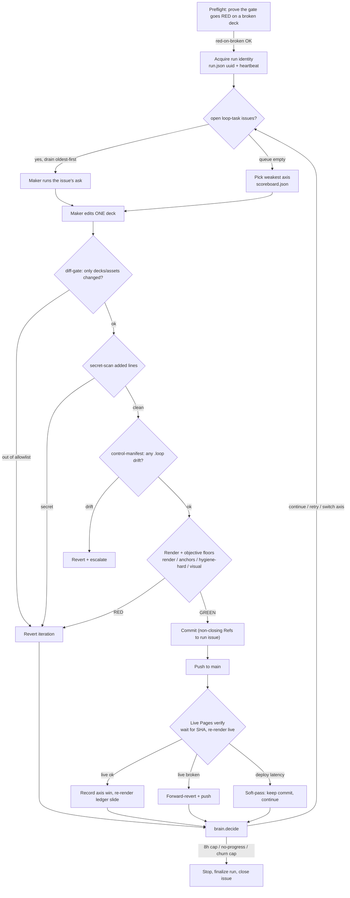

# `.loop/` — the autonomous deck self‑improvement engine

> A maker/checker control loop that makes the two Reveal.js decks in this repo
> (`index.html`, `workshop.html`) **measurably better, unattended, for up to 8 hours**,
> and pushes every verified improvement **straight to `main`** — no PRs, no human in the
> gate. The decks are the product; everything under `.loop/` is the machine that improves
> them while proving the repo's own thesis about loop engineering.

This document is the **engine + operator reference**. For the workshop framing (forking,
labs, the sample app) read the [top‑level `README.md`](../README.md). For the deck's design
system and the judge's taste rubric read [`design-tokens.md`](./design-tokens.md).

---

## 1. The thesis it embodies

The decks teach one idea: a good autonomous loop is four parts —

```
machine-checkable done-condition  →  a narrow maker  →  an independent checker  →  an explicit loop contract
```

This engine **is** that idea, pointed at the decks themselves:

| Thesis part | In this engine |
| --- | --- |
| Machine‑checkable done‑condition | `check.mjs` — the objective gate (Reveal inits, no console/page errors, slide‑count floor, no horizontal overflow) plus the content‑anchor, link‑hygiene and visual floors. |
| A narrow maker | `maker.mjs` shells out to the Copilot CLI with a **two‑tool** allowance (`view`, `write`) and may touch **only** the decks/assets. It proposes; it never decides. |
| An independent checker | The driver re‑renders the edited deck in a real browser and runs every gate. The maker cannot see, call, or weaken the checker. |
| An explicit loop contract | `brain.mjs` — pure decision logic with hard budgets (8 h, retries, no‑progress, churn cap). The loop's terminating conditions are code, not vibes. |

The deck even ships a self‑updating **improvement ledger** slide (§9) that counts the
loop's own verified commits — the presentation becomes living proof of its own argument.

---

## 2. Mental model

Four roles, strictly separated:

- **Maker proposes** — edits a deck toward one axis's goal. Least privilege.
- **Driver gates** — owns *all* git, gate, commit, push and revert decisions (`driver.mjs`).
- **Checker verifies** — renders the result and runs the objective floors (`check.mjs`,
  `anchors.mjs`, `hygiene.mjs`, `visual.mjs`).
- **Brain decides** — given an outcome, says continue / retry / switch axis / stop / escalate
  (`brain.mjs`, pure, no side effects, injected clock).

The single most important rule: **the maker can never edit the machine.** Everything under
`.loop/`, plus `.github/`, `.githooks/`, `package*.json` and git config, is the *control
plane* and is off‑limits and hash‑verified every iteration (§4). The loop must not be able
to edit its own gate.

---

## 3. The iteration lifecycle



Two design choices in that flow are worth calling out:

- **Live‑Pages verify never halts the run (D29).** A deploy that genuinely *breaks* live →
  forward‑revert and continue. A deploy that is merely *slow* to appear → **soft‑pass**: the
  commit stays on `main`, the run continues. Earlier the poll budget itself could halt a run;
  that self‑halt bug is gone.
- **The objective floor is the only thing that protects `main` (Premise 3).** Subjective
  quality (the delight judge, pixel‑drift, external‑link flakiness) **informs** which axis to
  work on next but can **never** revert `main`.

---

## 4. Control plane vs product — the safety model

The maker's entire world is an allowlist:

| | Paths | Who may write |
| --- | --- | --- |
| **Product** (maker‑editable) | `index.html`, `workshop.html`, `assets/**` | maker + driver |
| **Control plane** (immutable during a run, D28) | everything else under `.loop/`, `.github/**`, `.githooks/**`, `package*.json`, git config | driver only |

Defense in depth — an edit must clear **every** barrier below to reach `main`:

1. **diff‑gate** (`diff-gate.mjs`) — the working‑tree delta must be inside the allowlist, or
   the whole iteration is reverted *before* the checker even runs.
2. **secret‑scan** (`secret-scan.mjs`) — added lines are scanned for credential‑shaped
   tokens; a match reverts the iteration and is **redacted** in all output. A placeholder
   word‑list keeps the decks' own code snippets from false‑positiving.
3. **control‑manifest** (`control-manifest.mjs`) — a SHA‑256 manifest of every control‑plane
   file (CRLF‑normalised). Any drift → revert + escalate. The maker cannot weaken its own gate
   because changing the gate *is* drift. (The eight mutable runtime files in §8 are excluded.)
4. **objective floors** (the checker, §5).
5. **push‑gate** (`push-gate.mjs`) — an **independent, out‑of‑process** barrier wired into
   `.githooks/pre-push` and armed only for the loop (`LOOP_PUSH=1`). It re‑applies the
   allowlist, permits exactly the committed driver‑owned data files, and rejects secrets in
   the push diff. A second code path to `main`, by design.
6. **auto‑revert + live verify** — red before push → revert; broken after push →
   forward‑revert (we never `reset --hard` a public branch).

> **Why a maker can't cheat:** it has `view`/`write` only (no `shell`), a two‑file allowlist,
> a hash‑checked gate it can't touch, an out‑of‑process pre‑push hook, and a checker it can't
> see. Least privilege (D25) + immutable control plane (D28) + two independent barriers (D30).

---

## 5. The four axes & the objective floor

Each iteration works **one** axis. The maker prompt is built per‑axis (`maker.buildPrompt`).

| Axis | Goal | Gating? | Enforced by |
| --- | --- | --- | --- |
| `render` | Structural/visual integrity — Reveal inits, no console/page errors, slide count never drops, no horizontal overflow. | **HARD** | `check.mjs` (the gate, D2) + `visual.mjs` (D23) |
| `hygiene` | Link & asset hygiene — internal `#id` anchors resolve, local assets exist, markup stays clean. | **HARD** for internal/asset | `hygiene.mjs` (D33) |
| `freshness` | External citations stay live & current. | **SOFT** — a dead external link never reverts `main`; it's recorded and escalates only after `externalEscalateK` consecutive misses. | `hygiene.mjs` |
| `delight` | Subjective taste, judged against **this deck's own design tokens**, not generic "delight". | **NON‑GATING** (D19) — feeds the scoreboard only. Every failure mode returns "ok". | `delight.mjs` + [`design-tokens.md`](./design-tokens.md) |

The **objective floor** that actually protects `main`:

- **Render gate** (D2) — Reveal ready, zero console/page errors, slide‑count ≥ baseline, no overflow.
- **Content anchors** (`anchors.mjs`, D32) — heading **count** never regresses and the citation
  URL **set** stays a superset of the frozen baseline. Wording may change freely (informational).
- **Link‑hygiene hard checks** (D33) — broken internal anchors and missing local assets.
- **Visual invariants** (`visual.mjs`, D23) — losing a slide or introducing overflow is HARD;
  pixel drift is a SOFT flag and the baseline **refreshes on accept** so legitimate visual
  edits never self‑poison later iterations (D8).

Reveal hash routes (`#/`, `#/3`) and SVG `url(#…)` marker refs are exempt from anchor checks —
they're framework navigation, not element‑id references.

---

## 6. Weakest‑axis selection

`scoreboard.mjs` keeps a persistent board and always spends the next iteration on the
**lowest‑scoring axis** (ties → round‑robin by least‑recently‑picked). A verified green nudges
that axis's score up (attention shifts away); a revert/noop leaves it weak. A `retry` keeps the
**same** axis; any other outcome re‑selects. This replaces blind round‑robin so the loop's next
move always lands on whatever is lagging.

`scoreboard.json` shape:

```json
{ "seq": 110, "axes": { "render": { "score": 27, "lastPicked": 110, "samples": 27 }, "…": {} } }
```

`seq` is a monotonic counter (not wall‑clock) so round‑robin ordering is exact.

---

## 7. GitHub integration — observability & user‑directed work

Two distinct issue flows. Neither is ever an approval gate.

**Run‑tracking issue (`loop-run`, D4)** — one open issue per run, created before commit #1.
Every commit carries a *non‑closing* `Refs: #N` trailer. A clean end closes it as completed; a
failed run leaves it **open** with the `loop-escalation` label and a diagnosis comment.

**`loop-task` intake queue** — file a GitHub issue labeled `loop-task` and the loop will *do
the work*. Before each run's axis polish, `intake.mjs` drains open `loop-task` issues
(oldest‑first; `priority:high|low` boosts) through the **same** gated, live‑verified spine:

- Lands within the gates → commit to `main`, comment the deploying SHA on the issue, close it
  and label `loop-done`.
- Can't land within the gates (a structural ask — new/removed slides, theme/token edits) → the
  maker makes no change, the issue is labeled `loop-needs-review` and left **open**, and the
  loop moves on.

Bounded three ways (a `maxTasksPerRun` cap, the run's time budget, and `retryK` +
needs‑review exclusion). An empty queue is a no‑op, so the proven polish loop is unaffected.

| Label | Color | Meaning |
| --- | --- | --- |
| `loop-run` | `5319e7` | This issue tracks an active/finished run. |
| `loop-escalation` | `b60205` | A run failed and needs a human. |
| `loop-task` | `0e8a16` | Maintainer‑filed ask for the loop to execute. |
| `loop-done` | `c2e0c6` | A `loop-task` the loop landed on `main`. |
| `loop-needs-review` | `fbca04` | A `loop-task` the gates couldn't satisfy autonomously. |

---

## 8. State & data files

**Committed** (driver‑owned; may ride a push via the push‑gate allowlist, D5):

| File | What it is |
| --- | --- |
| `control-manifest.json` | SHA‑256 of every control‑plane file (the gate's own checksum). |
| `ledger.json` | The improvement ledger — every verified win by axis (drives the ledger slide). |
| `run.json` | Run identity: `uuid`, `status`, `started/heartbeat/endedMs`, `iters`, `issue`, `snapshotSha`. |
| `scoreboard.json` | The weakest‑axis board (§6). |
| `LOOP_STATUS` | Public one‑line terminal snapshot: `{ phase, reason, uuid, iters, ts }`. |

> The five files above are **excluded from the manifest** because they mutate every
> iteration — hashing them would read as control‑plane drift. They're trusted *data*, not
> *code*.

**Gitignored runtime** (regenerated each run; see [`.gitignore`](../.gitignore)):

| Path | What it is |
| --- | --- |
| `status.json` | Last full render snapshot (per‑deck slide/heading/citation counts). |
| `baseline/` | Frozen holdouts: slide & anchor baselines, per‑slide visual PNGs, external‑link miss counters. |
| `judge/` | Last delight verdict. |
| `failures.jsonl` | Append‑only diagnostic log of reverts/escalations. |
| `.env` | Secrets for the run (never printed, never committed). |
| `*.log` | Driver/loop logs. |

---

## 9. The improvement ledger

`ledger.mjs` regenerates a driver‑owned slide in `index.html` from `ledger.json`, between
`<!-- LEDGER:START -->` / `<!-- LEDGER:END -->`. It renders four states (empty / partial /
success / escalated), reuses existing components (`big-number`, `pill`, `flow`) so it adds no
new `:root` tokens or headings (the anchor floor never trips), and is **CRLF‑preserving and
idempotent** — re‑rendering the committed empty seed is a byte‑for‑byte no‑op, so the first
unattended run produces zero spurious deck churn.

`ledger.json` shape:

```json
{ "status": "running",
  "startedMs": 0, "endedMs": 0,
  "axes": { "render": 27, "hygiene": 26, "freshness": 26, "delight": 26 },
  "entries": [ { "iter": 1, "axis": "render", "sha": "7c3947e", "ts": "…" } ] }
```

---

## 10. Crash safety

Every run stamps a unique **UUID** into `run.json` and refreshes a **heartbeat** each
iteration (`crash-safety.mjs`, D34). At startup the loop classifies whatever record it finds:

| Situation | Action |
| --- | --- |
| No/corrupt record, or prior run ended cleanly | **start‑fresh** |
| Same UUID (re‑entry) | **resume** |
| A *different* run was `running` but its heartbeat is older than `heartbeatTtlMs` (15 min) | **finalize‑stale** — finalize the dead run, then start fresh; **never inherit its issue** |
| A *different* run is still heartbeating | **conflict** — refuse to start a second driver of `main` |

This closes the gap where a crash could leave the run‑issue open forever, or a new run could
silently adopt a dead run's history or double‑drive `main`.

---

## 11. Commands

All scripts are in [`package.json`](../package.json). None of these *push* unless noted.

**Verify the machine (safe, no push):**

| Command | What it proves |
| --- | --- |
| `npm run loop:check` | Run the objective deck gate once. |
| `npm run loop:verify` | Control‑plane has not drifted (add `-- --write` to re‑baseline). |
| `npm run loop:gate` | The diff‑gate verdict on the current working tree. |
| `npm run loop:scan` | Secret‑scan the working tree. |
| `npm run loop:pushgate` | Evaluate the pre‑push barrier. |
| `npm run loop:selftest` | Inject a *safe* deck edit → gate + manifest + check all green → revert clean. |
| `npm run loop:selftest-gate` | Inject a *forbidden* change → prove the diff‑gate blocks it. |
| `npm run loop:preflight` | **Red‑on‑broken** go/no‑go: the loop refuses to start if the gate can't catch a broken deck (D14). |
| `npm run loop:test` | The full pure‑logic unit suite (brain, gates, scoreboard, ledger, intake, …). |
| `npm test` | Repo‑wide `node --test` (includes the inventory exercise, which is red‑by‑design — **not** the loop gate). |

**Run the maker (writes; `loop:once` can push):**

| Command | Effect |
| --- | --- |
| `npm run loop:init` | Render both decks; write the slide/anchor baselines and the control manifest. |
| `npm run loop:dry` | One real maker iteration end‑to‑end, then revert — proves the pipeline without committing. |
| `npm run loop:once` | One real iteration; commit + push **if green**. |
| `npm run loop:run` | Preflight, then iterate until a stop condition or escalation. The full run. |
| `npm run loop:install-hooks` | `git config core.hooksPath .githooks` — arm the pre‑push barrier. |

**Environment for a live run:**

| Var | Purpose |
| --- | --- |
| `LOOP_MAKER=copilot` | Use the real Copilot‑CLI maker (default is a no‑op maker that only proves the spine). |
| `LOOP_COMMIT=1` | Allow the driver to commit & push verified greens. |
| `LOOP_MAX_ITERS=N` | Optional iteration cap (otherwise the 8 h budget terminates). |
| `GH_TOKEN=…` | Token the issue/intake/Pages calls authenticate with (owner‑gated — real maker/judge calls spend credits). |
| `LOOP_PUSH=1` | Set by the driver to arm the pre‑push hook; not for manual use. |

A typical unattended launch (Windows daemon):

```powershell
$env:LOOP_MAKER = 'copilot'; $env:LOOP_COMMIT = '1'
Start-Process -PassThru -WindowStyle Hidden node '.loop/loop.mjs','--run'
```

---

## 12. Budgets & terminators (`config.mjs`)

| Knob | Value | Role |
| --- | --- | --- |
| `LOOP.maxDurationMs` | 8 h | Hard wall‑clock cap (D36 — time terminates). |
| `LOOP.maxNoops` | 5 | Consecutive vacuous iterations → stop `no-progress`. |
| `LOOP.retryK` | 3 | Reverts on one axis before the brain switches axis. |
| `LOOP.churnWindowMs` / `churnMax` | 30 min / 6 | Too many forward‑reverts in the window → pause + escalate (D38 — anti‑thrash). |
| `LOOP.heartbeatTtlMs` | 15 min | Staleness threshold for the crash classifier. |
| `VIEWPORT` | 1280×720 | Canonical presentation viewport for render + visual diff. |
| `PAGES.maxWaitMs` / `pollIntervalMs` | 60 s / 10 s | Live‑Pages poll budget; exceeding it **soft‑passes** (never halts). |
| `MAKER` | `copilot`, tools `['view','write']`, ~240 s, ~80 cr/call | The narrow maker (shell deliberately excluded — D25). |
| `JUDGE` | temp 0, scaleMax 5, 5 equal‑weight criteria, ~35 cr/call | The pinned, drift‑frozen delight judge. |

---

## 13. Module index

Every file here is control plane (maker‑forbidden, manifest‑tracked).

| Module | Role |
| --- | --- |
| `loop.mjs` | Multi‑iteration orchestrator (`--preflight`, `--run`); intake drain + weakest‑axis polish; run acquire/heartbeat/finalize. |
| `driver.mjs` | Single‑iteration spine; owns **all** git/gate/commit decisions (`--init`, `--selftest`, `--selftest-gate`, `--dry`, `--once`). |
| `brain.mjs` | Pure decision logic — `categorize`, `shouldStartIteration`, `decide`, `selectAxis` (injected clock; exhaustively unit‑tested). |
| `config.mjs` | Central config — allowlists, budgets, labels, viewport, Pages/judge/intake policy. |
| `check.mjs` | **The gate** — `assertDeck` / objective render checks. Exit 0/1. |
| `render.mjs` | Shared single‑Chromium harness (`withBrowser`, `gotoReady`, `renderDeck`) — one browser launch for gate + visual (D9). |
| `anchors.mjs` | Content‑anchor floor (D32) — heading‑count + citation‑set non‑regression. |
| `hygiene.mjs` | Link hygiene/freshness (D33) — internal/asset hard, external soft. |
| `visual.mjs` | Per‑slide screenshot pixel‑diff (D23) — slide‑drop/overflow hard, drift soft, baseline‑refresh‑on‑accept. |
| `delight.mjs` | The non‑gating LLM‑judge axis (D19) — strict parse, never throws, feeds the scoreboard. |
| `scoreboard.mjs` | Weakest‑axis board (D10). |
| `ledger.mjs` | Self‑updating improvement‑ledger slide. |
| `intake.mjs` | `loop-task` issue queue → maker instruction, same gated spine. |
| `issue.mjs` | The `loop-run` observability issue lifecycle. |
| `pages.mjs` | Post‑push live‑Pages verify (D29) — `waitForSha`, `verifyLive`, soft‑pass/forward‑revert. |
| `diff-gate.mjs` | Per‑iteration allowlist gate. |
| `push-gate.mjs` | Independent pre‑push barrier (allowlist ∪ data files + secret scan). |
| `secret-scan.mjs` | Added‑line credential scan with redaction. |
| `control-manifest.mjs` | SHA‑256 control‑plane manifest + `verify`/`--write`. |
| `crash-safety.mjs` | Run identity + heartbeat + stale‑run classifier (D34). |
| `maker.mjs` | `noopMaker` (proves the spine) + `copilotMaker` / `copilotTaskMaker` (shells `copilot -p`). |
| `lib/proc.mjs` | `spawnSync` wrapper (`shell:false`, explicit args). |
| `lib/git.mjs` | Narrow git ops (`headSha`, `shortSha`, `isClean`, `changedFiles`, gated `push`). |
| `tests/*.test.mjs` | Pure‑logic unit suites for every module above (no git/network/browser). |
| `design-tokens.md` | The deck's design system + the judge's anti‑slop rubric anchor (D20). |

---

## 14. Design‑decision glossary (as referenced in the code)

The code comments cite numbered design decisions. The ones that appear in this engine:

| ID | Decision |
| --- | --- |
| D2 | The objective deck gate (`check.mjs`) — never `npm test`. |
| D4 | One `loop-run` issue per run; non‑closing `Refs: #N` commit trailers. |
| D5 | Split commit policy — code + `ledger/run/scoreboard/LOOP_STATUS/control-manifest` committed; baselines/judge/logs/.env gitignored. |
| D8 | Visual baseline refreshes on accept (no self‑poison). |
| D9 | One shared Chromium launch for render + visual. |
| D10 | Lowest‑score‑wins axis selection, tie → round‑robin. |
| D14 | Pre‑flight red‑on‑broken go/no‑go before iteration 1. |
| D18 | Anti‑slop blacklist enforced as a machine sub‑axis. |
| D19 | Delight judge is non‑gating. |
| D20 | Judge rubric anchored to `design-tokens.md`, not generic delight. |
| D23 | Visual regression at the canonical 1280×720 viewport; slide‑drop/overflow hard. |
| D25 | Maker least privilege — `copilot -p` with `view`/`write` only, no shell. |
| D28 | Control‑plane immutability — `.loop/**` hash‑verified each iteration. |
| D29 | Bounded live‑Pages verify; soft‑pass on latency, forward‑revert on breakage, never halt. |
| D30 | Two independent barriers to `main` — diff‑gate + out‑of‑process pre‑push hook. |
| D31 | Per‑iteration staged‑diff secret scan + `--ignore-scripts` installs. |
| D32 | Objective content‑anchor floor (headings/citations) alongside non‑gating delight. |
| D33 | Internal/asset links hard‑gate; external citations soft + K‑miss escalation. |
| D34 | Crash‑safe run lifecycle — UUID + heartbeat TTL + stale‑run finalizer. |
| D35 | Slop/anchor checks read the rendered DOM, not regex on HTML. |
| D36 | Iteration count is best‑effort; terminators are the stop conditions + 8 h cap. |
| D38 | Revert‑churn cap — too many forward‑reverts in a window → escalate. |

*(Premise 3: subjective quality is advisory; only the objective floor protects `main`.)*

---

## 15. See also

- [Top‑level `README.md`](../README.md) — the workshop: forking, labs, the sample app.
- [`design-tokens.md`](./design-tokens.md) — palette, type, voice, and the anti‑slop rubric.
- The live decks: **https://ridermw.github.io/loops-of-fury/** (`index.html`) and
  **/workshop.html**.
